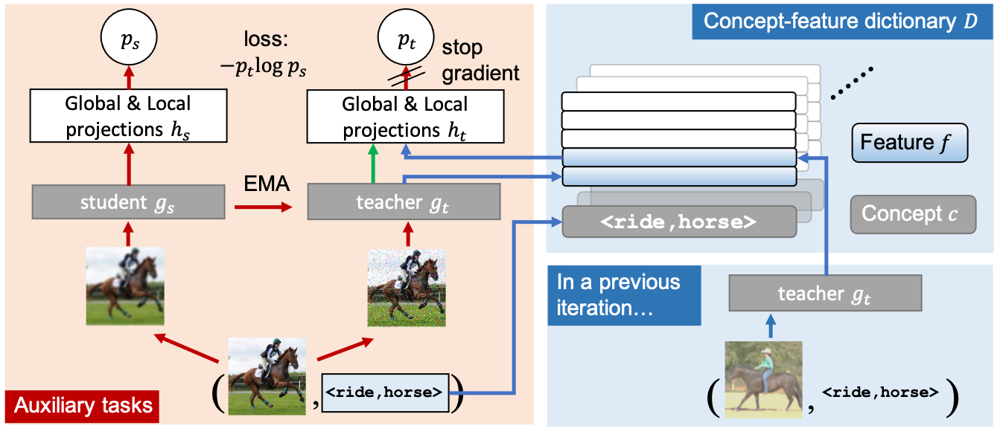

RelViT
===

<p align="center"></p>

This repository hosts the code for the paper:

[RelViT: Concept-guided Vision Transformer for Visual Relational Reasoning (ICLR 2022)](https://web.cs.ucla.edu/~xm/file/relvit_iclr22.pdf)

by [Xiaojian Ma](http://web.cs.ucla.edu/~xm), [Weili Nie](https://weilinie.github.io/), [Zhiding Yu](https://chrisding.github.io/), [Huaizu Jiang](https://jianghz.me/), [Chaowei Xiao](https://xiaocw11.github.io/), [Yuke Zhu](https://www.cs.utexas.edu/~yukez/) and [Anima Anandkumar](http://tensorlab.cms.caltech.edu/users/anima/)

[arXiv](https://arxiv.org/abs/2204.11167) | [Poster](https://web.cs.ucla.edu/~xm/file/relvit_iclr22_poster.pdf) | [Slides](https://web.cs.ucla.edu/~xm/file/relvit_iclr22_slides.pdf)


## Abstract

Reasoning about visual relationships is central to how humans interpret the visual world. This task remains challenging for current deep learning algorithms since it requires addressing three key technical problems jointly: **1)** identifying object entities and their properties, **2)** inferring semantic relations between pairs of entities, and **3)** generalizing to novel object-relation combinations, i.e., systematic generalization. In this work, we use **vision transformers (ViTs)** as our base model for visual reasoning and make better use of concepts defined as object entities and their relations to improve the reasoning ability of ViTs. Specifically, we introduce a novel concept-feature dictionary to allow flexible image feature retrieval at training time with concept keys. This dictionary enables two new concept-guided auxiliary tasks: 1) a **global task** for promoting relational reasoning, and 2) a **local task** for facilitating semantic object-centric correspondence learning. To examine the systematic generalization of visual reasoning models, we introduce systematic splits for the standard HICO and GQA benchmarks. We show the resulting model, **Concept-guided Vision Transformer** (or **RelViT** for short) significantly outperforms prior approaches on HICO and GQA by **16%** and **13%** in the original split, and by **43%** and **18%** in the systematic split. Our ablation analyses also reveal our model's compatibility with multiple ViT variants and robustness to hyper-parameters.

## Installation

- Install PyTorch:
    ```shell
    conda install pytorch torchvision torchaudio cudatoolkit=11.3 -c pytorch
    ```

- Install the necessary packages with `requirements.txt`:
    ```shell
    pip install -r requirements.txt
    ```

The code has been tested with Python 3.8, PyTorch 1.11.0 and CUDA 11.6 on Ubuntu 20.04

##  Data Preparation

Please refer to [data preparation](assets/dataset.md)

## Training

<details><summary>HICO</summary>

```shell
bash scripts/train_hico_image.sh configs/train_hico.yaml
```

### Note

- In `configs/train_hico.yaml` you may find some configurable options:
    - use `eval_mode` to run different experiments: original or systematic generalization test
    - use `model_args.encoder_args.encoder` and `load_encoder` to select the vision backbone. There are five options available: `pvtv2_b2`, `pvtv2_b3`, `swin_small`, `swin_base` and `vit_small_16`.
    - use `relvit` to turn on/off RelViT auxillary loss
    - use `relvit_weight` to adjust the coefficient of RelViT auxillary loss
    - use `relvit_local_only` to control if you only use RelViT local/global task
    - use `relvit_mode` to control if you want to include [EsViT](https://github.com/microsoft/esvit) loss.
    - use `relvit_sample_uniform` to choose from uniform or "most-recent" concept sampling
    - use `relvit_concept_use` and `relvit_num_concepts` to choose the concept used by RelViT among `HOI`, `verb` and `object`

    In general, we don't recommend modifying other parameters.

- All the GPUs will be used by default. To run with the recommended batch size, you may need 1 V100 32G GPU.

</details>

<details><summary>GQA</summary>

```shell
bash scripts/train_gqa_image.sh configs/train_gqa.yaml
```

### Note

- In `configs/train_gqa.yaml` you may find some configurable options:
    - use `eval_mode` to run different experiments: original or systematic generalization test
    - use `model_args.encoder_args.encoder` and `load_encoder` to select the vision backbone. There are five options available: `pvtv2_b2`, `pvtv2_b3`, `swin_small`, `swin_base` and `vit_small_16`.
    - use `relvit` to turn on/off RelViT auxillary loss
    - use `relvit_weight` to adjust the coefficient of RelViT auxillary loss
    - use `relvit_local_only` to control if you only use RelViT local/global task
    - use `relvit_mode` to control if you want to include [EsViT](https://github.com/microsoft/esvit) loss
    - use `relvit_sample_uniform` to choose from uniform or "most-recent" concept sampling

    In general, we don't recommend modifying other parameters.

- All the GPUs will be used by default. To run with the recommended batch size, you may need up to 64 V100 32G GPUs. This is because we need to fine-tune the vision backbone during training.

</details>

## Testing

<details><summary>HICO</summary>

```shell
bash scripts/train_hico_image.sh configs/train_hico.yaml --test_only --test_model <path to best_model.pth>
```

</details>

<details><summary>GQA</summary>

```shell
bash scripts/train_gqa_image.sh configs/train_gqa.yaml --test_only --test_model <path to best_model.pth>
```

</details>

## License

Please check the LICENSE file. This work may be used non-commercially, meaning for research or evaluation purposes only. For business inquiries, please contact researchinquiries@nvidia.com.

## Acknowledgement

The authors have referred the following projects:

[SimCLR](https://github.com/google-research/simclr)

[DenseCL](https://github.com/WXinlong/DenseCL)

[EsViT](https://github.com/microsoft/esvit)

[Swin-Transformer](https://github.com/microsoft/Swin-Transformer)

[PVT](https://github.com/whai362/PVT)

[HICODet](https://github.com/fredzzhang/hicodet)

[MCAN](https://github.com/MILVLG/mcan-vqa)

## Citation

Please consider citing our paper if you find our work helpful for your research:

```
@inproceedings{ma2022relvit,
    title={RelViT: Concept-guided Vision Transformer for Visual Relational Reasoning},
    author={Xiaojian Ma and Weili Nie and Zhiding Yu and Huaizu Jiang and Chaowei Xiao and Yuke Zhu and Song-Chun Zhu and Anima Anandkumar},
    booktitle={International Conference on Learning Representations},
    year={2022},
    url={https://openreview.net/forum?id=afoV8W3-IYp}
}
```